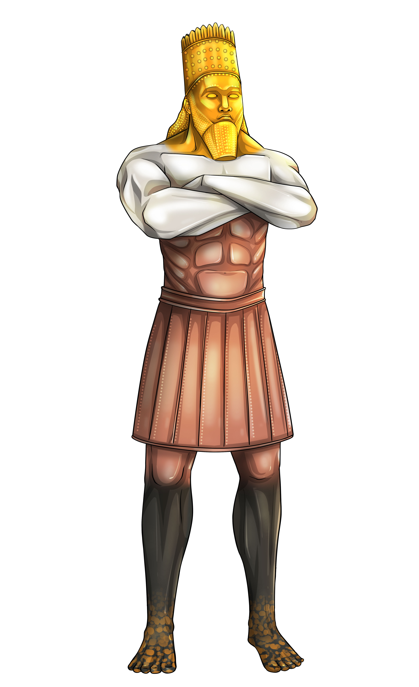

# The Image from Daniel 2

Create a 3D character in Blender to represent the image from Daniel 2. The description is found in the verses 31 to 33:

> “You, O king, were watching, and you saw an immense image. That image, which was huge and extremely bright, was standing in front of you, and its appearance was terrifying. The head of that image was of fine gold, its chest and its arms were of silver, its abdomen and its thighs were of copper, its legs were of iron, and its feet were partly of iron and partly of clay.

Some examples how the final product should look like:

   

## Progress

First steps in Blender 2024/03/26

There is already a 3D asset available: https://sketchfab.com/3d-models/modelo-estatua-shades-6308cba32e874b9fb6adcd932235e46e

And without color: https://sketchfab.com/3d-models/modelo-estatua-sonho-nabucodonosor-b1c735d5675043ecb4b649ece1740b5c

## Order at fiverr - Rizal M

## Order at fiverrr - Isuru 2024-06-15

