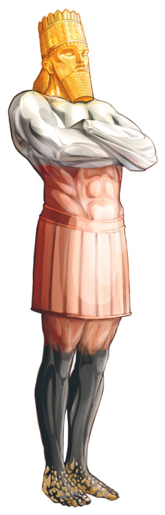
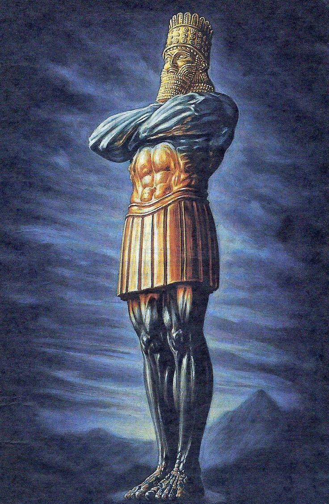
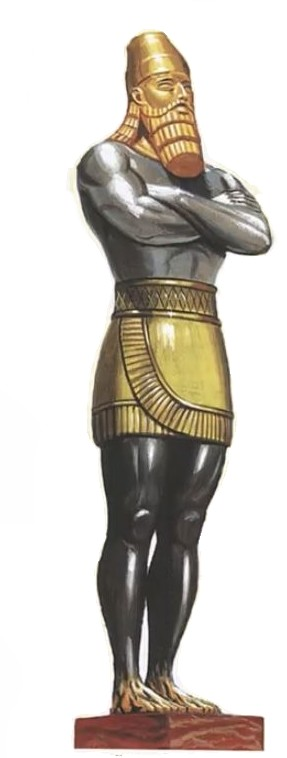
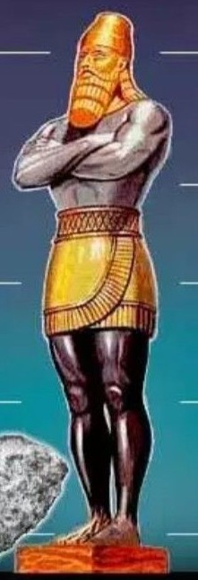
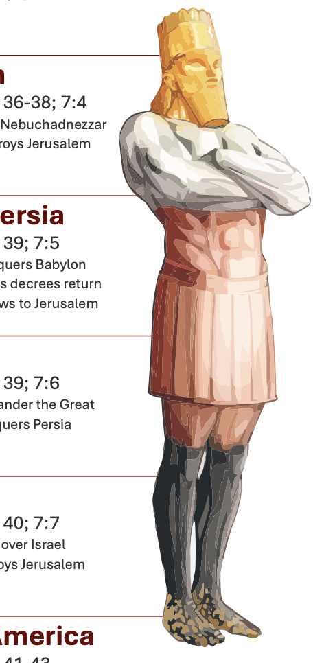
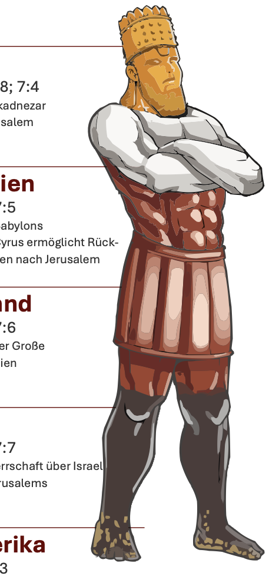
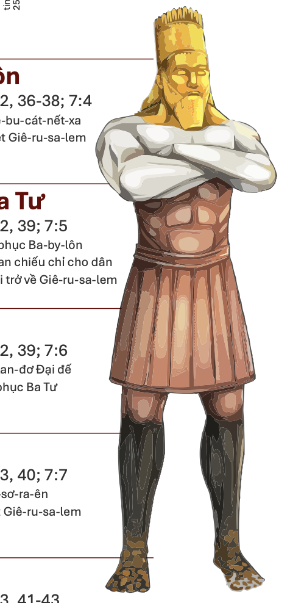

# The Image from Daniel 2

Create a 3D character in Blender to represent the image from Daniel 2.

Some examples how the final product should look like:

   

## Progress

First steps in Blender 2024/03/26

There is already a 3D asset available: https://sketchfab.com/3d-models/modelo-estatua-shades-6308cba32e874b9fb6adcd932235e46e

And without color: https://sketchfab.com/3d-models/modelo-estatua-sonho-nabucodonosor-b1c735d5675043ecb4b649ece1740b5c

## Results from fiverr - got 2 works in June 2024

  
