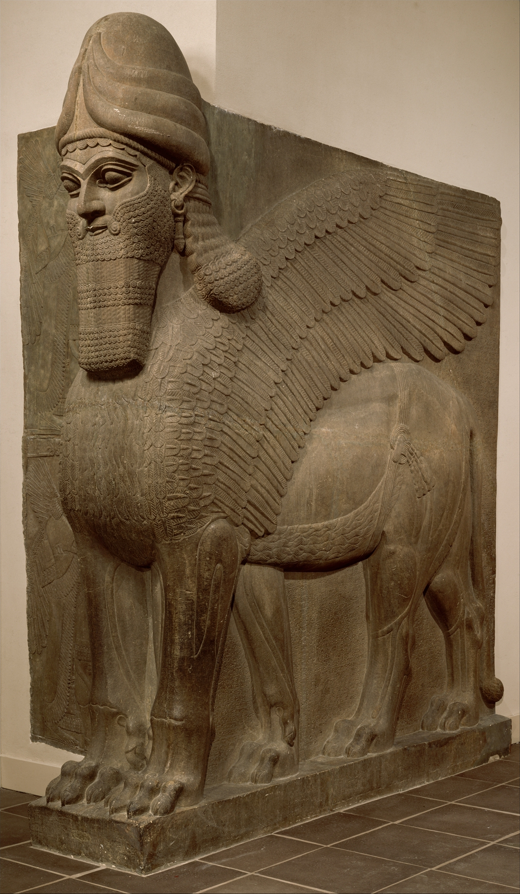
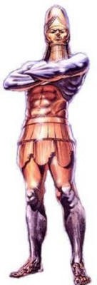
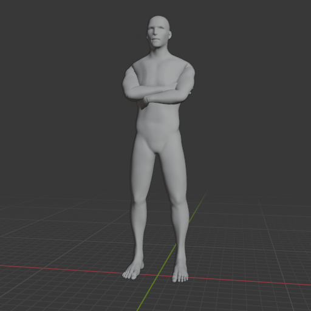
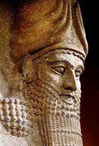

# Image ordered on fiverr.com - Rizal M

Details:

- Ordered from Rizal M [@masyhurizal](https://www.fiverr.com/masyhurizal/)
- Delivery date: Jun 10, 2024, 12:33 PM
- Total price: $13.05
- Order number: #FO618BFF17582 

## Update request 2024-06-10

Hi Rizal M, thank you for your work! I like the details in the helmet and muscles and its close to what I imagined. I guess with a few refinements its possible. I added 5 comments on the drawing. Not sure if it helps, I have 3 more pictures as reference for the pose and the beard attached here. The third one is from the MET with a stone image of the Assyrians picturing themselves a few thousand years ago with their beard.

Thank you!

### Sargon Assyrian example beard

### Color and pose example

### Pose 20 degrees left

## Update request 2024-06-19

Hi Rizal M,

Thanks for all the hard work and look for detail. I noticed even more when zooming in. And I'm happy with the changes from the revision. I would like to ask just for one final tough: The face with eyes and beard. Is it possible to have the beard look more as if it transitions from the face and does not look as an add-on? Is it possible to make the face a little smaller in proportion to the rest of the body? And have the eyes indicated more with different shades of gold/yellow and less with drawn black lines? That would be nice.

I found two pictures of stone sculptures of Assyrian faces from 2500 years ago that might visualize what I have in mind. Thank you very much!

### Beard

### Sargon Assyrian example beard

